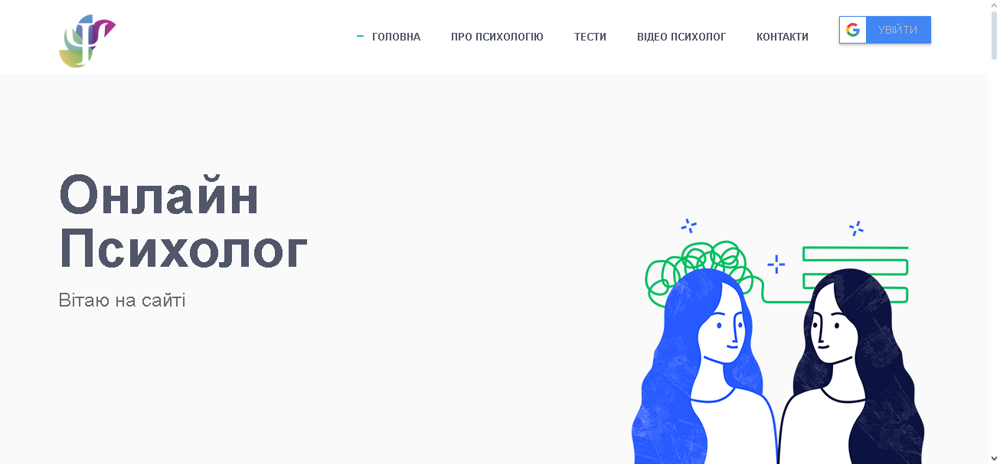
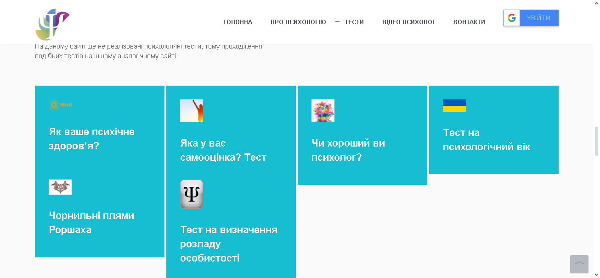
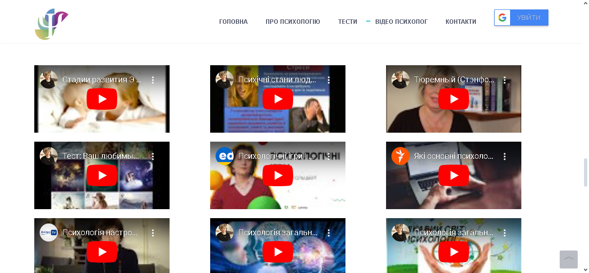
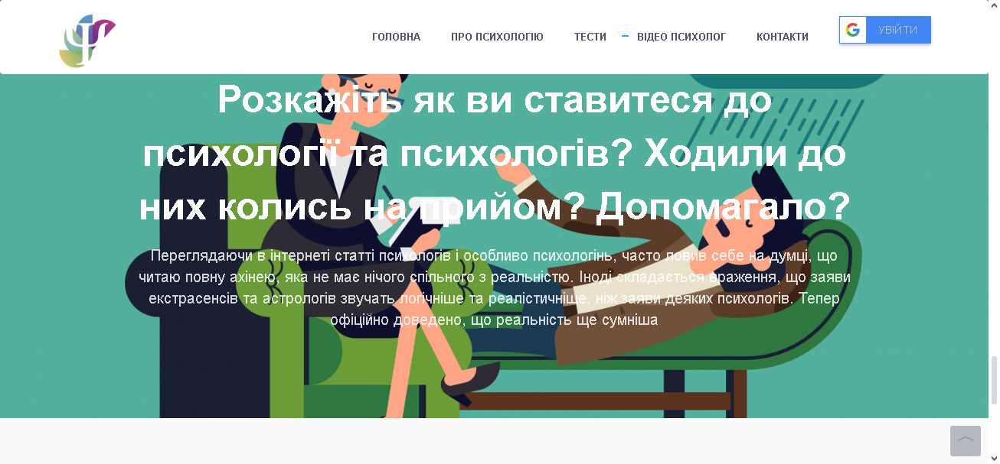

<p align="center"></p>
<h1 align="center">online-psychologist</h1>

## Description
<b>EN:</b>

This is a revised version of a course project I was commissioned ([Online-Psychologist](https://github.com/CoolOtaku/Online-Psychologist)).

The project visualizes the work of a business card website with publications on the topic of psychology. There is also a path test to determine the psychological state. Using its own API.

The project also has a Telegram bot, on which you can choose a psychologist and communicate with him.

<b>UA:</b>

Це доопрацьована версія курсового проекту, який у мене замовили ([Online-Psychologist](https://github.com/CoolOtaku/Online-Psychologist)).

Проект візуалізує роботу сайту візитки з публікаціями на тему психології. Також присутня пату тестування для визначення хсихічного стану. З використанням власного API.

Проект також має Telegram бот, на якому можна вибрати собі психолога та спілкуватися з ним.

#
## Screenshots
<p>
  
  
  
  
  
</p>

#
## Technologies used
<b>EN:</b>
- Using Bootstrap (front-end framework)
- Using a third-party template for site layout (built on Bootstrap)
- Using a MySQL database
- Creating your own API
- Creating a Telegram bot
- Using the Firebase service for data storage and push notifications
- Using embedded YouTube videos
- Navigation on the site

<b>UA:</b>
- Використання Bootstrap (front-end framework)
- Використання стороннього шаблону для макета сайту (на основі Bootstrap)
- Використання бази даних MySQL
- Створення власного API
- Створення Telegram-бота
- Використання служби Firebase для зберігання даних і push-повідомлень
- Використання вбудованих відео YouTube
- Навігація по сайту
#
## License
```
© 2022, CoolOtaku (ericspz531@gmail.com)
```
